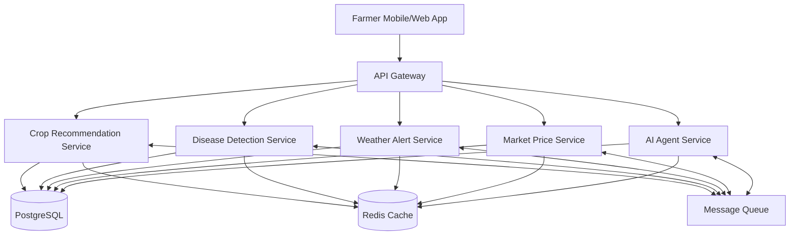
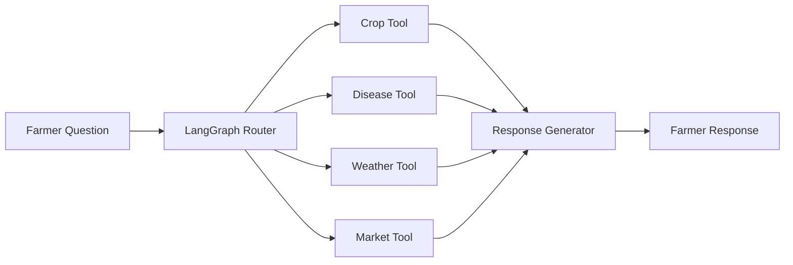
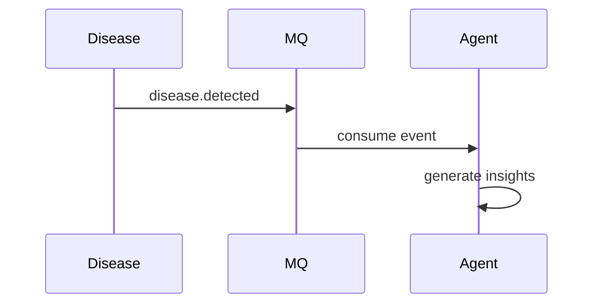
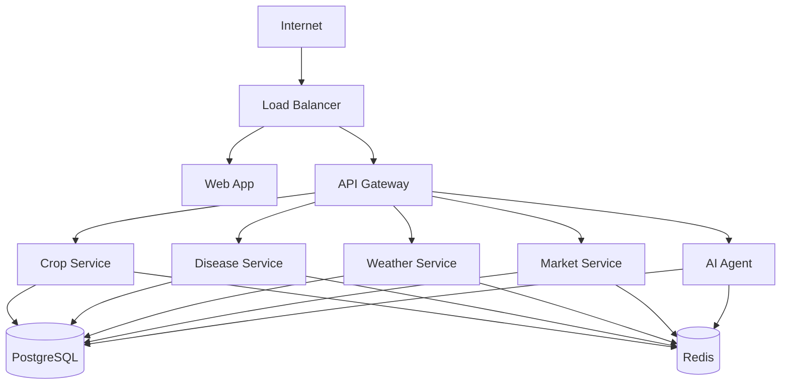

# KrishiMitra AI - System Architecture

## Overview

KrishiMitra AI is a microservice-based agricultural intelligence platform that helps farmers with:

* Crop recommendations
* Plant disease detection
* Weather alerts
* Market price intelligence
* AI-powered farming assistance

The system follows Domain Driven Design (DDD) principles and consists of independent FastAPI microservices communicating through REST APIs and asynchronous events.

---

## High-Level Architecture

---

## AI Agent Architecture

The AI Agent acts as an orchestration layer.

Business logic remains inside dedicated services.

---

## Service Responsibilities

### API Gateway

Responsibilities:

* Authentication
* Request routing
* Rate limiting
* API aggregation
* Logging

---

### Crop Recommendation Service

Responsibilities:

* Crop recommendation
* Fertilizer recommendation
* Yield prediction
* Soil analysis

Technologies:

* FastAPI
* Scikit-learn
* PostgreSQL

---

### Disease Detection Service

Responsibilities:

* Image upload
* OpenCV preprocessing
* Disease classification
* Treatment recommendations

Technologies:

* FastAPI
* OpenCV
* TensorFlow/PyTorch

---

### Weather Alert Service

Responsibilities:

* Weather forecasts
* Weather alerts
* Crop risk assessments
* Notification generation

Technologies:

* FastAPI
* APScheduler

---

### Market Price Service

Responsibilities:

* Mandi prices
* Price trends
* Market comparisons
* Sell recommendations

Technologies:

* FastAPI
* Scheduled crawlers

---

### AI Agent Service

Responsibilities:

* Multi-tool reasoning
* Context management
* Conversation memory
* Service orchestration

Technologies:

* LangGraph
* LangChain
* Gemini/OpenAI

---

## Database Architecture

### Shared PostgreSQL

Initial MVP uses a shared PostgreSQL database.

Tables:

* users
* farms
* crops
* disease_reports
* weather_alerts
* market_prices
* conversations
* recommendations

Future scaling may split databases per service.

---

## Event-Driven Communication

Events:

* disease.detected
* weather.alert.generated
* crop.recommendation.generated
* market.price.updated

Example flow:

---

## Deployment Architecture

---

## Future Enhancements

* Kafka for event streaming
* Kubernetes deployment
* Vector database for AI memory
* RAG over agricultural knowledge base
* Multilingual voice assistant
* Real-time pest outbreak prediction
* Satellite imagery integration
