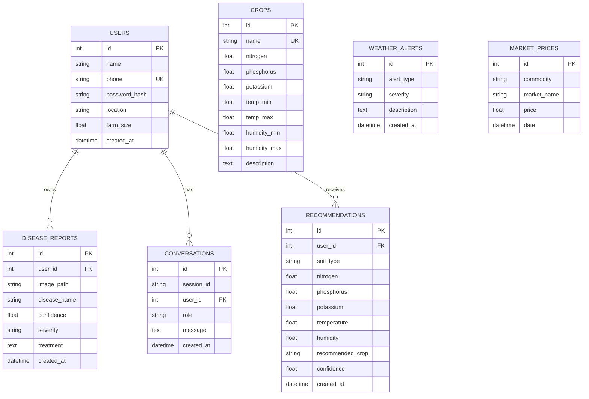

# KrishiMitra AI - Low-Level Design (LLD) Document

This document details the low-level design specifications, data models, schemas, and control flows for the **KrishiMitra AI** microservices platform.

---

## 1. Database Schema & SQLAlchemy Models

All database tables are mapped via SQLAlchemy models inside `shared/database/models.py`.



### 1.1 Model Class Definitions

#### `User` Table (`users`)
- **`id`** (`Integer`, Primary Key, autoincrement): Unique identifier for the user.
- **`name`** (`String`, non-nullable): User's full name.
- **`phone`** (`String`, unique, indexed, non-nullable): Phone number used for authentication.
- **`password_hash`** (`String`, non-nullable): Hashed user password (bcrypt).
- **`location`** (`String`, nullable): Geographic location (e.g. State, Region) for localized weather alerts.
- **`farm_size`** (`Float`, nullable): Farm size in acres.
- **`created_at`** (`DateTime`, defaults to UTC now): Account registration timestamp.

#### `Crop` Table (`crops`)
- **`id`** (`Integer`, Primary Key): Unique identifier.
- **`name`** (`String`, unique, non-nullable): Crop name (e.g. Rice, Maize).
- **`nitrogen` / `phosphorus` / `potassium`** (`Float`, non-nullable): Optimal NPK levels.
- **`temp_min` / `temp_max`** (`Float`, non-nullable): Optimal temperature ranges in Celsius.
- **`humidity_min` / `humidity_max`** (`Float`, non-nullable): Optimal humidity ranges (%).
- **`description`** (`Text`, nullable): Additional crop details/care instructions.

#### `DiseaseReport` Table (`disease_reports`)
- **`id`** (`Integer`, Primary Key)
- **`user_id`** (`Integer`, Foreign Key -> `users.id`)
- **`image_path`** (`String`, non-nullable): Supabase public storage URL or local filesystem path.
- **`disease_name`** (`String`, non-nullable): Identified plant disease.
- **`confidence`** (`Float`, non-nullable): Detection confidence score (0.0 to 1.0).
- **`severity`** (`String`, non-nullable): Severity classification (`Low`, `Moderate`, `High`).
- **`treatment`** (`Text`, nullable): Recommended treatment/curing list.
- **`created_at`** (`DateTime`)

#### `WeatherAlert` Table (`weather_alerts`)
- **`id`** (`Integer`, Primary Key)
- **`alert_type`** (`String`): Alert classification (`Heavy Rain`, `Drought`, `Frost`, `Heatwave`).
- **`severity`** (`String`): Alert severity level (`Low`, `Moderate`, `High`).
- **`description`** (`Text`): Information and precautions for the farmer.
- **`created_at`** (`DateTime`)

#### `MarketPrice` Table (`market_prices`)
- **`id`** (`Integer`, Primary Key)
- **`commodity`** (`String`, indexed): Commodity name (e.g. Rice, Wheat).
- **`market_name`** (`String`): Mandi name where the price is tracked.
- **`latitude`** (`Float`, nullable): Geographic latitude of the mandi.
- **`longitude`** (`Float`, nullable): Geographic longitude of the mandi.
- **`price`** (`Float`): Price in INR.
- **`date`** (`DateTime`)

#### `Conversation` Table (`conversations`)
- **`id`** (`Integer`, Primary Key)
- **`session_id`** (`String`, indexed): Chat session/thread identifier.
- **`user_id`** (`Integer`, Foreign Key -> `users.id`, nullable)
- **`role`** (`String`): Message sender (`user` or `assistant`).
- **`message`** (`Text`): Actual message content.
- **`created_at`** (`DateTime`)

#### `Recommendation` Table (`recommendations`)
- **`id`** (`Integer`, Primary Key)
- **`user_id`** (`Integer`, Foreign Key -> `users.id`)
- **`soil_type`** (`String`, nullable)
- **`nitrogen` / `phosphorus` / `potassium` / `temperature` / `humidity`** (`Float`, nullable)
- **`recommended_crop`** (`String`, non-nullable)
- **`confidence`** (`Float`, non-nullable)
- **`created_at`** (`DateTime`)

---

## 2. API Data Validation (Pydantic Schemas)

Schemas are maintained inside `shared/schemas/schemas.py` using Pydantic v2.

### 2.1 Authentication & Profile Schemas
- **`Token`** / **`TokenData`**: Handles OAuth2 JSON Web Tokens (`access_token`, `token_type`, `phone`, `user_id`).
- **`UserCreate`**: Validates user registration. Requires `name`, `phone` (regex format), `password` (min length 6), and optional profile details.
- **`UserLogin`**: Requires `phone` and `password`.
- **`UserOut`**: Serializes user info without exposing password hashes.
- **`ProfileUpdate`**: Allows partial modification of name, location, and farm size.

### 2.2 Crop Services Schemas
- **`CropRecommendRequest`**: Validates input soil features.
  - `nitrogen`: `float` (range: `0` to `200`)
  - `phosphorus`: `float` (range: `0` to `200`)
  - `potassium`: `float` (range: `0` to `200`)
  - `temperature`: `float` (range: `-10` to `60`)
  - `humidity`: `float` (range: `0` to `100`)
- **`CropRecommendResponse`**: `recommended_crop` (`str`), `confidence` (`float`), `reason` (`str`).
- **`FertilizerRequest`**: Contains current crop, soil type, and NPK levels.
- **`YieldRequest`**: Contains crop name, farm size in acres, soil type, and expected rainfall.

### 2.3 Image Processing Schemas
- **`DiseaseDetectResponse`**: Represents ML output containing detected `disease`, `confidence`, `severity`, and an array of `treatment` strategies.

### 2.4 Weather Schemas
- **`WeatherCurrentResponse`**: Curated current metrics (`temperature`, `humidity`, `condition`, `wind_speed`).
- **`WeatherAlertItem`**: Individual warning item (`type`, `severity`, `description`).

### 2.5 Market Schemas
- **`MarketPriceResponse`**: Lists available mandi prices for a commodity sorted by proximity to the user. Includes coordinates and calculated distances.
  - `commodity`: `str`
  - `user_coords`: `dict` (containing `latitude` and `longitude`)
  - `markets`: list of items containing `name`, `price`, `distance_km`, `state`, `district`.
- **`MarketComparisonResponse`**: Returns the highest-yielding market within the search radius including its name, price, and distance, along with `alternative_markets`.

---

## 3. Microservices Interface Specifications

Each microservice implements standard RESTful endpoints under `/api/v1/...`.

### 3.1 API Gateway
- `POST /api/v1/auth/register` -> Proxies to Auth handlers, returns a user object.
- `POST /api/v1/auth/login` -> Proxies to Auth, returns JWT.
- `GET /api/v1/crop/{path}` -> Routes to Crop Service.
- `POST /api/v1/disease/detect` -> Routes to Disease Service.
- `GET /api/v1/weather/forecast` -> Routes to Weather Service.
- `GET /api/v1/market/prices` -> Routes to Market Price Service.
- `POST /api/v1/agent/chat` -> Routes to AI Agent Service.

### 3.2 Crop Recommendation Service
- `POST /api/v1/crop/recommend` -> Performs Euclidean distance metric or ML inference against database records to find optimal matches.
- `POST /api/v1/crop/fertilizer` -> Computes NPK deficiency and suggests correction amounts.
- `POST /api/v1/crop/yield` -> Predicts estimate harvest yields.

### 3.3 Disease Detection Service
- `POST /api/v1/disease/detect` -> Accepts raw multi-part image uploads. Invokes OpenCV processing and a PyTorch CNN model to classify crop diseases.

### 3.4 Weather Alert Service
- `GET /api/v1/weather/current` -> Fetches from cache, or falls back to public weather APIs.
- `GET /api/v1/weather/forecast` -> Fetches multi-day forecasting.
- `GET /api/v1/weather/alerts` -> Retrieves any regional active weather alert models from the database.

### 3.5 Market Price Service
- `GET /api/v1/market/prices` -> Queries external commodity APIs (e.g., National Agriculture Market / Agmarknet API) to synchronize daily price rates, computes distances from user coordinates using the Haversine formula, and filters/sorts results by proximity.
- `GET /api/v1/market/compare` -> Compares commodity rates across nearest mandis within a specific geographic radius.
- `POST /api/v1/market/sync` -> Internal background task trigger to pull data from external Gov/agri endpoints, geocode mandis, and populate the database.

---

## 4. AI Agent Workflow Design (LangGraph Graph)

The agent service orchestrator is built inside `services/ai-agent-service/app/main.py`.

```text
       [State: messages, session_id, user_id, context]
                              │
                              ▼
                        ┌───────────┐
                        │   Node:   │
                        │ call_model│ (Invokes LLM with bound tools)
                        └─────┬─────┘
                              │
                              ├──────────── Conditional Routing ────────────┐
                              │                                             │
                              ▼ (has tool calls)                            ▼ (no tool calls / finished)
                        ┌───────────┐                                   ┌───────┐
                        │   Node:   │                                   │  END  │
                        │   tools   │ (Executes API-based tools)        └───────┘
                        └─────┬─────┘
                              │
                              ▼
                         (Loop back)
```

### 4.1 State Object Definition
The state tracking model is defined as:
```python
class AgentState(TypedDict):
    messages: Annotated[List[BaseMessage], operator.add]
    session_id: str
    user_id: int
    context: Dict[str, Any]
```

### 4.2 Tool Bindings
- **`crop_recommendation_tool`**: Binds parameters `nitrogen`, `phosphorus`, `potassium`, `temp`, `humidity`. Triggers an internal HTTP request to the Crop Service (`8001`).
- **`market_price_tool`**: Binds parameter `commodity`. Triggers an HTTP request to the Market Price Service (`8004`).
- **`weather_alert_tool`**: Binds parameter `location`. Triggers an HTTP request to the Weather Service (`8003`).

---

## 5. Security Architecture (JWT Validation Flow)

1. The client sends user credentials to `/api/v1/auth/login`.
2. The API Gateway delegates to the Auth Helper, validates the password hash, and responds with a JWT token signed using the HS256 algorithm:
   ```json
   {
     "access_token": "eyJhbGciOi...",
     "token_type": "bearer"
   }
   ```
3. For protected routes, the client includes the token in the `Authorization: Bearer <token>` header.
4. The API Gateway decodes the token, extracts the `user_id`, and appends an `X-User-ID` custom header to forward to the microservices:
   ```text
   X-User-ID: 12
   ```

---

## 6. Cache Policy (Redis Strategy)

To avoid excessive external API traffic and heavy database scans, caching is implemented on specific endpoints:

| Cache Key Pattern | Expire TTL | Eviction / Update Event | Service |
| :--- | :--- | :--- | :--- |
| `weather:forecast:<lat>:<lon>` | 2 Hours (7200s) | TTL Expire | Weather |
| `market:prices:<commodity>` | 6 Hours (21600s) | New Mandi update seed | Market |
| `crop:recommendation:hash` | 24 Hours (86400s) | Soil data changes | Crop |

---
